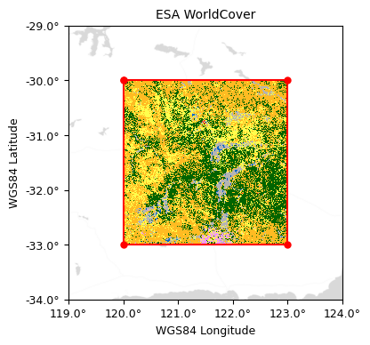
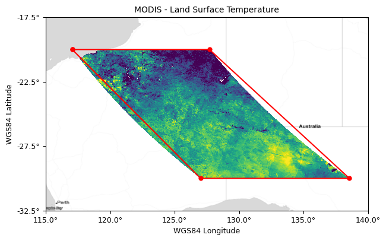

# The stactools Raster Footprint Utility

*stactools: a command line utility and Python library for STAC.*

## Motivation

Every STAC Item contains a geometry object that defines the geospatial extent of the data described by the Item. For raster data, the geometry object contains one or more polygons enclosing the raster pixels, i.e., the footprint of the raster. At first glance, creating this *raster footprint* seems a straightforward task. Raster data is inherently rectangular, so a polygon with a vertex at each corner of the raster grid should be sufficient. Using an ESA WorldCover tile as an example, we see that it is cleanly bounded by a simple four-vertex polygon:



Case closed, right? Not quite! We "cheated" in the above example. The native coordinate reference system (CRS) of the ESA WorldCover image is the geographic WGS84 (EPSG:4326) system. This is the same CRS required by the geometry object in a STAC Item, meaning the raster data and our minimal raster footprint polygon naturally align in this case. But most remote sensing data is stored in a projected CRS and is therefore distorted with respect to WGS84. A better example is a MODIS raster tile, which uses a sinusoidal projection. When viewed in WGS84, we see that a raster footprint defined by the four corners of the raster grid isn't quite up to the task:



We have a gap on the east and gore on the west. Not great. And it's not just aesthetics at play here. These inaccuracies are relevant to downstream applications that work with STAC Items, e.g., STAC APIs that respond to queries for Items within a defined polygon or bounding box. Discrepancies between Item geometry objects and actual data extents will result in spurious or missing Items in API responses.

In addition to tightly bounding the raster grid extents in the WGS84 CRS, it may be desirable to exclude regions of the raster that do not contain meaningful information, e.g., the small region of open ocean in the northwest corner of our example MODIS image, which happens to be a land surface temperature product. Raster pixels that do not contain meaningful data are assigned a constant value, typically termed the "no-data" or "fill" value. We'd like an option to exclude regions of these no-data pixels from a raster footprint.

Finally, we want to balance footprint accuracy versus complexity. Perfect accuracy can require (up to) a vertex at every pixel corner, resulting in polygons with huge lists of vertex coordinates. When dealing with millions of STAC Items, large footprints cause storage bloat and risk degrading spatial query performance when retrieving Items from a database. So we'd like to have options to tune this tradeoff between accuracy and complexity.

>*Our task, then, is to generate raster footprint polygons in the WGS84 CRS that tightly bound raster pixels containing valid data, regardless of the raster's native CRS, with an eye on balancing accuracy versus complexity.*

## The stactools approach

At a high level, the stactools approach to generating a raster footprint is to extract a polygon surrounding the valid data in the raster's native CRS and then to transform (aka reproject) that polygon to the required WGS84 CRS. This is in contrast to transforming the raster data to WGS84 first, and then extracting a footprint. We'll discuss why stactools does not use this latter approach when we wrap up this blog post.

If we look a bit closer by examining the implementation in the [source code](https://github.com/stac-utils/stactools/blob/main/src/stactools/core/utils/raster_footprint.py), we see there are four core steps:

1. Extract a polygon surrounding the valid data in the raster's native CRS.
2. Densify the polygon with additional vertices.
3. Reproject the densified polygon from the raster's native CRS to WGS84.
4. Simplify the densified, reprojected polygon.

Densifying the polygon refers to inserting new vertices between existing ones. This is done prior to reprojection to better capture projection distortion, which causes straight lines to become curved. Once projected, however, there may be more vertices than necessary to maintain a desired accuracy. This is handled by applying a simplification process that removes as many polygon vertices as possible, while maintaining a maximum allowable error tolerance between the initial and simplified polygons.

To make these concepts clearer, let's work through each step of the process along with the options that are available to tune the footprint characteristics. We'll produce images as we go to illustrate the effect of the options, using the same MODIS tile shown above as our example. But before we get started, let's add a bit of context regarding implementation. The minimum signature to generate a stactools raster footprint is:

```python
footprint = RasterFootprint(data_array, crs, transform).footprint()
```

where `data_array` is a [NumPy](https://numpy.org/) array of raster data, `crs` is the coordinate reference system in a form understood by [rasterio](https://rasterio.readthedocs.io/en/stable/), and `transform` is a an [Affine](https://github.com/rasterio/affine) matrix for converting image space coordinates to geospatial coordinates. We'll cover the raster footprint API in more detail in the next section - for now, just understand that any options we discuss are passed as arguments when initializing the [`RasterFootprint`](https://stactools.readthedocs.io/en/latest/api.html#stactools.core.utils.raster_footprint.RasterFootprint) class.

OK, enough background information. Let's dive in!

### Step 1: Polygon extraction

Footprint polygon extraction is centered on rasterio's `features.shapes` function, which returns a polygon and pixel value for each connected region of pixels having a common value. Since we are only interested in polygons that enclose regions of valid data (we don't care what the actual data values are), we feed `features.shapes` a binary mask created from the raster data. All valid data pixels are assigned a value of 1 and no-data pixels assigned a value of 0 in the mask. The set of polygons with a corresponding pixel value of 1 are retained.

If a single polygon is retained, extraction is finished. However, raster data often contains many isolated regions of valid data, e.g., islands along the coast in our example MODIS tile. This has the potential to produce large numbers of small polygons, greatly increasing the number of retained polygons and the complexity of the ultimate raster footprint. To avoid this complexity, a convex hull is applied to the shape extraction results if more that one polygon is retained after shape extraction.

*Options:*

- `no_data`: Defines the pixel value to set to 0 during mask creation. The default value is `None`, in which case a footprint for the entire raster grid is calculated. This is the footprint shown in the prior MODIS image. When we use a `no_data` value of 0 for our MODIS tile, the resulting footprint now clips off the small area of ocean in the northwest corner of the tile:


### Step 2: Densification

Reprojecting spatial data from one CRS to another introduces distortion. Our MODIS example illustrates that if the footprint polygon vertices are widely spaced, the distortion is not adequately captured. We can improve the situation by adding new vertices to the polygon prior to reprojection. The polygons can be densified either by factor or by distance (mutually exclusive).

*Options:*

- `densification_factor`: The factor by which to increase point density within the footprint polygon before reprojection to WGS84. For example, a factor of 2 would double the density of points by placing one new point between each existing pair of points. In the MODIS example below, a factor of 3 was used, which places two new points between each existing pair of points:


- `densification_distance`: The distance, in the linear unit of the raster's native CRS, by which to increase point density within the footprint polygon before reprojection to WGS84. For example, if the distance is set to 2 meters and the segment length between a pair of points is 6 meters, two new points would be created along the segment, each 2 meters apart. We'll use a spacing of 200,000 meters for our MODIS example. Notice how the points are no longer clustered in the northwest corner when using this densification method:


### Step 3: Reprojection

Reprojection is the transformation of the densified footprint polygon from the raster's native CRS to WGS84. The raster footprint utility uses rasterio's `transform_geom` function for reprojection.

*Options:*

- `precision`: An integer value that sets the number of decimal places reported in the vertex coordinates of the returned polygon. This does not influence the result other than to limit the implied coordinate precision to a reasonable number of decimal places.

### Step 4: Simplification

If projection distortion is low and/or the polygon was heavily densified prior to reprojection, the reprojected polygon will likely contain more vertices than desired. This complexity is balanced by removing vertices such that any removed vertex will be within a defined error threshold (tolerance) distance to the simplified polygon. Under the hood, the [Douglas-Peucker algorithm](https://en.wikipedia.org/wiki/Ramer%E2%80%93Douglas%E2%80%93Peucker_algorithm) is used for the simplification.

*Options:*

- `simplify_tolerance`: The distance, in WGS84 degrees, within which all vertices of the original polygon will be to the simplified polygon. A good rule of thumb is to use 1/2 the ground pixel width (converted to decimal degrees), but this will depend on the amount of projection distortion. Here we use a coarser value of 5 times the ground pixel width (about 0.05 degrees) for illustration purposes. Notice how the redundant points along the straight portions of the north and south lines have all been removed:


## Implementation

The raster footprints shown in above examples were created by instantiating the stactools `RasterFootprint` class and calling the `footprint()` method on the instance. For example, the MODIS footprint shown in most recent image was created with:

```python
footprint = RasterFootprint(
    data_array,
    crs,
    transform,
    nodata=0,
    densification_distance=200000,
    simplify_tolerance=0.05
).footprint()
```

In practice, it is usually more convenient to use one of `RasterFootprint`'s alternative constructors, bypassing the need to separately obtain and provide the `data_array`, `crs`, and `transform` arguments. Two alternative constructors are provided:

- [`from_href`](https://stactools.readthedocs.io/en/latest/api.html#stactools.core.utils.raster_footprint.RasterFootprint.from_href): Creates a class instance from a path or URL to a raster file.
- [`from_rasterio_dataset_reader`](https://stactools.readthedocs.io/en/latest/api.html#stactools.core.utils.raster_footprint.RasterFootprint.from_rasterio_dataset_reader): Creates a class instance from a rasterio open dataset object, e.g., from the `src` object created by `src = rasterio.open(href)`.

You can also directly update the geometry object of a STAC Item to use a raster footprint by passing the Item and a list of one or more of the Item's asset names to the [`update_geometry_from_asset_footprint`](https://stactools.readthedocs.io/en/latest/api.html#stactools.core.utils.raster_footprint.RasterFootprint.update_geometry_from_asset_footprint) method. The Item geometry is updated with the first successful footprint generated from the provided list of asset names. Finally, the [`data_footprint_for_data_assets`](https://stactools.readthedocs.io/en/latest/api.html#stactools.core.utils.raster_footprint.RasterFootprint.data_footprints_for_data_assets) method also accepts a STAC Item and a list of asset names, but produces an iterator over the same asset names along with their corresponding footprints. Check out the raster footprint module's [documentation](https://stactools.readthedocs.io/en/latest/api.html#module-stactools.core.utils.raster_footprint) and [source code](https://github.com/stac-utils/stactools/blob/main/src/stactools/core/utils/raster_footprint.py) for more details.

The `RasterFootprint` class can also be sub-classed to override the methods for a custom implementation. In fact, if you use the raster footprint utility with MODIS data, you'll find that footprint polygons that abut the edge of the projection may contain spurious vertices. We didn't experience this in the examples used throughout this post because our example MODIS tile is well within the projection extents. The [`modis` stactools package](https://github.com/stactools-packages/modis) contains a custom `SinusoidalFootprint` class that inherits from `RasterFootprint` and overrides the reprojection step to ensure clean polygons along the projection edges.

## Closing thoughts

When summarizing the stactools approach to creating a raster footprint, we promised a bit more information on why stactools does not use an alternate - and potentially simpler - approach: reproject the raster data to WGS84 first and then extract a footprint outlining the data, thereby bypassing the need for densification. There are several reasons why the stactools raster footprint utility did not take this approach:

- Raster reprojection is computationally expensive.
- Raster reprojection creates a new grid of pixels which can introduce small (sub-pixel) changes to the data extents.
- In keeping with the desire for simple footprints, the stactools approach uses a convex hull to produce a single polygon footprint in instances where shape extraction produces multiple polygons. Referring back to the very first MODIS example image, we see that a convex hull applied to the raster data in the WGS84 CRS would produce result in a gap on the east side, which is something we are deliberately trying to avoid.

That said, we'd be interested to learn about your experience if you've implemented an alternate approach to creating raster footprint polygons.

Writing this post and creating the visuals has been instructive. In addition to finding and fixing a bug or two, I kept a running list of potential improvements. All are opinions, but two of them stand out enough that I believe other users would have similar observations. The first is that specifying the distance for the `simplify_tolerance` option in the linear unit of geographic degrees is unintuitive. It would be great if we could use the raster's native linear unit, e.g., meters or feet. Second, I'd like to be able to turn off the convex hull operation. There are some datasets where multiple regions of valid data exist in many product tiles, but the regions are few in number and simple in shape (ESA WorldCover comes to mind). In these cases, using a multi-polygon for the Item geometry would not introduce much additional complexity and would better describe the regions of valid raster data.

Wrapping up, stactools is just one library in a broader free and open-source STAC ecosystem. Although certainly not the only resource, the [stac-utils](https://github.com/stac-utils) GitHub organization is a good starting point when looking for STAC-related tools. If you have an idea for a new feature or find a bug in the stactools raster footprint utility, please open an issue in the stactools [GitHub repository](https://github.com/stac-utils/stactools)! We'd love to collaborate with you in building and improving the STAC ecosystem.
